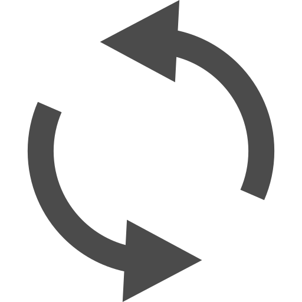

# taskmarket.html のHTML要素階層

## 📋 全体構造

```
html
└── head
    ├── meta (charset, viewport)
    ├── title
    └── style (CSS定義)
└── body
    ├── スプラッシュスクリーン
    ├── ヘッダー
    ├── メインコンテナ
    ├── ゴミ箱
    ├── タスク詳細パネル
    ├── タイムレコードパネル
    ├── PC版メニューボタン
    ├── SP版メニューボタン
    ├── 円形メニュー
    ├── モーダル：タスク入力フォーム
    ├── モーダル：バッジ作成フォーム
    └── スライドインパネル（パネル2・パネル5）
```

## 🔍 詳細階層

### 1. スプラッシュスクリーン (`splashScreen`)

```html
<div class="splash-screen" id="splashScreen">
    
</div>
```

### 2. ヘッダー (`header`)

```html
<header class="header">
    <div class="header-left">
        <div class="logo">📋 Task Market</div>
        <button class="nav-button">ホーム</button>
        <button class="nav-button">タスク</button>
        <button class="nav-button">プロジェクト</button>
    </div>
    <div class="header-right">
        <div id="googleSignInContainer">
            <!-- ログイン前: Googleログインボタン -->
            <div id="googleSignInButton"></div>
            
            <!-- ログイン後: ユーザー情報表示 -->
            <div id="userInfo">
                
                <span id="userName"></span>
                <button class="nav-button" onclick="signOut()">ログアウト</button>
            </div>
        </div>
    </div>
</header>
```

### 3. メインコンテナ (`main-container`)

```html
<div class="main-container">
    <div class="main-board">
        <div class="task-grid" id="taskGrid">
            <!-- プルリフレッシュインジケーター -->
            <div class="pull-refresh-indicator" id="pullRefreshIndicator">
                <div class="pull-refresh-spinner"></div>
                <span>更新中...</span>
            </div>
            
            <!-- プルリフレッシュヒント（スマホ版のみ） -->
            <div class="pull-refresh-hint" id="pullRefreshHint">
                「更新」は画面を下にひいてください
            </div>
            
            <!-- 新規追加ボタン（下部中央に固定） -->
            <button class="add-task-button" type="button" onclick="toggleTaskForm(event)">
                +
                <span class="tooltip-text">新規タスクを追加</span>
            </button>
            
            <!-- 完了ボタン（左下に固定） -->
            <div class="complete-button" id="completeButton">
                <span class="complete-icon">✓</span>
                <span class="tooltip-text">ドラッグ&ドロップで完了</span>
            </div>
            
            <!-- バッジを作るボタン（右上に固定・◯デザイン） -->
            <button class="add-badge-button" onclick="openBadgeForm()">
                <span class="badge-icon-text">🏷️</span>
                <span class="tooltip-text">バッジを作る</span>
            </button>
            
            <!-- タスクカードがここに動的に生成されます -->
            <div style="...">
                <p>タスクがありません</p>
                <p>左下の「+」ボタンからタスクを作成してください</p>
            </div>
        </div>
    </div>
</div>
```

### 4. ゴミ箱 (`trashBin`)

```html
<div class="trash-bin" id="trashBin">
    <span class="trash-icon">🗑️</span>
    <span class="tooltip-text">ドラッグ&ドロップで削除</span>
</div>
```

### 5. タスク詳細パネル (`detailBoard`)

```html
<div class="detail-board-overlay" id="detailBoardOverlay" onclick="closeDetailBoardOnOverlay(event)">
    <div class="detail-board" id="detailBoard" onclick="event.stopPropagation()">
        <div class="detail-board-header">
            <div>
                <h2 class="detail-title">タスク詳細</h2>
                <p>モード切り替えボタンで詳細の「編集」が行えます。</p>
            </div>
            <div>
                <button class="detail-time-record-button" id="detailTimeRecordButton" onclick="showTimeRecords()">
                    <span>🕐</span>
                    <span class="tooltip-text">タイムレコード</span>
                </button>
                <button class="detail-edit-button" id="detailEditButton" onclick="toggleTaskEditMode()">
                    
                    <span class="tooltip-text">タスク情報の編集はこちらから</span>
                </button>
                <button class="detail-board-close-button" onclick="closeDetailBoard()">×</button>
            </div>
        </div>
        <div id="detailContent">
            <!-- タスク詳細内容が動的に生成されます -->
        </div>
    </div>
</div>
```

### 6. タイムレコードパネル (`timeRecordPanel`)

```html
<div class="time-record-panel-overlay" id="timeRecordPanelOverlay" onclick="closeTimeRecordPanelOnOverlay(event)">
    <div class="time-record-panel" id="timeRecordPanel" onclick="event.stopPropagation()">
        <div class="time-record-panel-header">
            <h2 class="time-record-panel-title">タイムレコード</h2>
            <button class="time-record-panel-close-button" onclick="closeTimeRecordPanel()">×</button>
        </div>
        <div id="timeRecordContent">
            <!-- タイムレコード内容が動的に生成されます -->
        </div>
    </div>
</div>
```

### 7. PC版メニューボタン (`menuButtonPC`)

```html
<div class="menu-button menu-button-pc" id="menuButtonPC" data-menu-button="true">
    
    <span class="tooltip-text">ダブルクリックでメニュー展開</span>
</div>
```

### 8. SP版メニューボタン (`menuButtonSP`)

```html
<div class="menu-button menu-button-sp" id="menuButtonSP" draggable="true" data-menu-button="true">
    
    <span class="tooltip-text">ダブルタップでメニュー展開</span>
</div>
```

### 9. 円形メニュー (`circularMenu`)

```html
<div class="circular-menu" id="circularMenu">
    <div class="circular-menu-item" data-action="mypage" style="--angle: 0deg;">
        
    </div>
    <div class="circular-menu-item" data-action="resource" style="--angle: 90deg;">
        
    </div>
    <div class="circular-menu-item" data-action="archive" style="--angle: 180deg;">
        
    </div>
    <div class="circular-menu-item" data-action="settings" style="--angle: 270deg;">
        
    </div>
</div>
```

### 10. モーダル：タスク入力フォーム (`taskFormModal`)

```html
<div class="modal-overlay" id="taskFormModal" onclick="closeModalOnOverlay(event)">
    <div class="task-form" onclick="event.stopPropagation()">
        <div class="task-form-header">
            <h3 class="task-form-title">新しいタスクを作成</h3>
            <button class="modal-close-button" onclick="cancelTaskForm()">×</button>
        </div>
        <form id="taskInputForm">
            <div class="form-group">
                <label for="taskTitle">タスクタイトル *</label>
                <input type="text" id="taskTitle" name="title" required>
            </div>
            <div class="form-group">
                <label for="taskDescription">説明</label>
                <textarea id="taskDescription" name="description"></textarea>
            </div>
            <div class="form-group">
                <label for="taskCategory">カテゴリー</label>
                <select id="taskCategory" name="category">
                    <option value="design">デザイン</option>
                    <option value="frontend">フロントエンド</option>
                    <option value="backend">バックエンド</option>
                    <option value="database">データベース</option>
                    <option value="media">メディア</option>
                    <option value="other">その他</option>
                </select>
            </div>
            <div class="form-group">
                <label for="taskPriority">優先度</label>
                <select id="taskPriority" name="priority">
                    <option value="low">低</option>
                    <option value="medium" selected>中</option>
                    <option value="high">高</option>
                </select>
            </div>
            <div class="form-group">
                <label for="taskEstimatedTime">予想作業時間</label>
                <select id="taskEstimatedTime" name="estimatedTime">
                    <!-- 10分〜8時間までのオプション -->
                </select>
            </div>
            <div class="form-actions">
                <button type="button" class="btn btn-secondary" onclick="cancelTaskForm()">キャンセル</button>
                <button type="submit" class="btn btn-primary">作成</button>
            </div>
        </form>
    </div>
</div>
```

### 11. モーダル：バッジ作成フォーム (`badgeFormModal`)

```html
<div class="modal-overlay" id="badgeFormModal" onclick="closeBadgeFormOnOverlay(event)">
    <div class="task-form" onclick="event.stopPropagation()">
        <div class="task-form-header">
            <h3 class="task-form-title">新しいバッジを作成</h3>
            <button class="modal-close-button" onclick="cancelBadgeForm()">×</button>
        </div>
        <form id="badgeInputForm">
            <div class="form-group">
                <label for="badgeName">バッジ名（担当者名）*</label>
                <input type="text" id="badgeName" name="name" required>
            </div>
            <div class="form-group">
                <label for="badgeIcon">アイコン（絵文字）</label>
                <input type="text" id="badgeIcon" name="icon">
            </div>
            <div class="form-group">
                <label for="badgeColor">カラー</label>
                <input type="color" id="badgeColor" name="color" value="#FF679C">
            </div>
            <div class="form-actions">
                <button type="button" class="btn btn-secondary" onclick="cancelBadgeForm()">キャンセル</button>
                <button type="button" class="btn btn-google" id="createFromGoogleBtn" onclick="createBadgeFromGoogle()">
                    🔵 Googleアカウントから作成
                </button>
                <button type="submit" class="btn btn-primary">作成</button>
            </div>
        </form>
    </div>
</div>
```

### 12. スライドインパネル：パネル2（リソース管理）

```html
<div class="slide-panel-overlay" id="slidePanelOverlay2" onclick="closeSlidePanelOnOverlay(event, 2)">
    <div class="slide-panel panel-2" id="slidePanel2" onclick="event.stopPropagation()">
        <div class="slide-panel-header panel-2">
            <h2 class="slide-panel-title">リソース管理</h2>
            <button class="slide-panel-close-button" onclick="closeSlidePanel(2)">×</button>
        </div>
        <div class="slide-panel-content">
            <!-- タブ切り替え -->
            <div class="resource-tabs">
                <button class="resource-tab active" data-tab="members" onclick="switchResourceTab('members')">
                    メンバー一覧
                </button>
                <button class="resource-tab" data-tab="schedule" onclick="switchResourceTab('schedule')">
                    週次・月次計画
                </button>
                <button class="resource-tab" data-tab="timeline" onclick="switchResourceTab('timeline')">
                    タイムライン
                </button>
            </div>
            
            <!-- メンバー一覧タブ -->
            <div id="resourceMembersTab" class="resource-tab-content active">
                <div id="resourceMembersContent">
                    <!-- メンバー一覧が動的に生成されます -->
                </div>
            </div>
            
            <!-- 週次・月次計画タブ -->
            <div id="resourceScheduleTab" class="resource-tab-content">
                <div>
                    <div>
                        <select id="scheduleViewType" onchange="updateScheduleView()">
                            <option value="week">週次表示</option>
                            <option value="month">月次表示</option>
                        </select>
                        <button onclick="prevSchedulePeriod()">← 前</button>
                        <button onclick="nextSchedulePeriod()">次 →</button>
                        <button onclick="todaySchedulePeriod()">今日</button>
                    </div>
                    <div id="scheduleContent">
                        <!-- 週次・月次計画が動的に生成されます -->
                    </div>
                </div>
            </div>
            
            <!-- タイムラインタブ -->
            <div id="resourceTimelineTab" class="resource-tab-content">
                <div>
                    <div>
                        <label>フィルター:</label>
                        <select id="timelineFilter" onchange="updateTimelineView()">
                            <option value="all">全メンバー</option>
                            <!-- メンバーオプションが動的に追加されます -->
                        </select>
                    </div>
                    <div id="timelineContent">
                        <!-- タイムラインが動的に生成されます -->
                    </div>
                </div>
            </div>
        </div>
    </div>
</div>
```

### 13. スライドインパネル：パネル5（アーカイブ）

```html
<div class="slide-panel-overlay" id="slidePanelOverlay5" onclick="closeSlidePanelOnOverlay(event, 5)">
    <div class="slide-panel panel-5" id="slidePanel5" onclick="event.stopPropagation()">
        <div class="slide-panel-header panel-5">
            <h2 class="slide-panel-title">アーカイブ</h2>
            <button class="slide-panel-close-button" onclick="closeSlidePanel(5)">×</button>
        </div>
        <div class="slide-panel-content">
            <!-- フィルター機能 -->
            <div class="archive-filter">
                <h3>フィルター</h3>
                <div>
                    <div>
                        <label>日付</label>
                        <select id="archiveFilterDate">
                            <option value="all">すべて</option>
                            <option value="today">今日</option>
                            <option value="week">今週</option>
                            <option value="month">今月</option>
                            <option value="year">今年</option>
                        </select>
                    </div>
                    <div>
                        <label>担当者</label>
                        <select id="archiveFilterAssignee">
                            <option value="all">すべて</option>
                        </select>
                    </div>
                    <div>
                        <label>カテゴリ</label>
                        <select id="archiveFilterCategory">
                            <option value="all">すべて</option>
                            <option value="design">デザイン</option>
                            <option value="frontend">フロントエンド</option>
                            <option value="backend">バックエンド</option>
                            <option value="database">データベース</option>
                            <option value="media">メディア</option>
                            <option value="other">その他</option>
                        </select>
                    </div>
                    <div>
                        <label>検索</label>
                        <input type="text" id="archiveFilterSearch" placeholder="タイトルで検索">
                    </div>
                </div>
            </div>
            
            <!-- 完了済タスクアーカイブ -->
            <div id="archiveTaskList" class="archive-task-list">
                <!-- 完了済タスクが動的に生成されます -->
            </div>
        </div>
    </div>
</div>
```

## 🎯 主要な動的要素

### タスクカード（JavaScriptで動的生成）

```javascript
// タスクカードは以下の構造で生成されます
<div class="task-card" 
     draggable="true" 
     data-task-id="{taskId}"
     style="left: {leftPercent}%; top: {topPercent}%;">
    <div class="task-card-header">
        <h3 class="task-card-title">{title}</h3>
        <div class="task-card-priority">
            <!-- 優先度に応じた星アイコン -->
        </div>
        
    </div>
    <div class="task-card-body">
        <p class="task-card-description">{description}</p>
    </div>
    <div class="task-card-footer">
        <div class="task-card-category">
            
            <span>{categoryLabel}</span>
        </div>
        <div class="task-card-priority">
            <!-- 優先度に応じた星アイコン -->
        </div>
        <div class="task-card-badges">
            <!-- バッジが動的に追加されます -->
        </div>
    </div>
</div>
```

### バッジ（JavaScriptで動的生成）

```javascript
// バッジは以下の構造で生成されます
<div class="badge" 
     draggable="true" 
     data-badge-id="{badgeId}"
     style="left: {left}px; top: {top}px; background-color: {color};">
    {icon}
    <span class="badge-name">{name}</span>
</div>
```

## 📝 注意事項

- タスクカードとバッジはJavaScriptで動的に生成されるため、HTML内には初期構造のみが記載されています
- 各パネル・モーダルは `display: none` で初期状態は非表示です
- スライドインパネルは左から右にスライドインするアニメーションが設定されています
- モーダルは画面中央にオーバーレイとして表示されます

